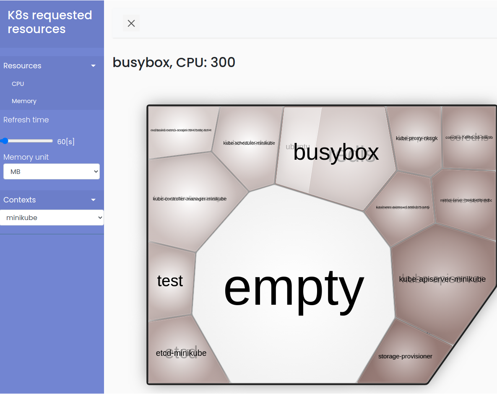

# k8s-pod-foamtree

It's web server which uses *~/.kube/config* file for presenting resource request set for pods. It uses foamtree package for visualization. Dashboard has two option for visualization:
- cpu
- memory

Foamtree view is refreshed automaticaly every 60 seconds by default. Refresh frequency might be change by range slider.



Node is represented by square shape box. Foams are pods. If pod contains more than one container pod foam is splited into sub-foams. Empty foam represents unused (free) resources avaiable on node.

## Memory unit
Below memory units are avaiable for displaing:
- KB
- MB
- GB
- TB

## Context
Context combobox allows for switching current k8s context. **Context is changed only in k8s-pod-foamtree web server not in ~/.kube/config file.**

## Installation

### Prerequisites
Install [uv](https://docs.astral.sh/uv/) package manager:
```bash
curl -LsSf https://astral.sh/uv/install.sh | sh
```

### Install from source
```bash
# Install dependencies and the package in development mode
make restore_dev

# Or install without dev dependencies
make restore
```

### Install via PyPi
```bash
pip install k8sfoams
# or with uv
uv pip install k8sfoams
```

## Run k8s-pod-foamtree
After installation, run the application:
```bash
# Using make
make run

# Or directly
k8sfoams

# Or with uv run
uv run k8sfoams
```

## Command lines arguments
- host: host IP address on which server listen, default is **127.0.0.1**
- port: port number on which server listen, default is **8080**
- d: turn on **debug** mode when server starts

Example:
```bash
k8sfoams --host 0.0.0.0 --port 8080 -d
```

## Development

### Running tests
```bash
# Run all tests (type checking, linting, security, unit tests)
make tests

# Run individual test suites
make unit_tests
make static_code_analysis
make check_types
make bandit
```

### Building the package
```bash
make build
```

### Clean build artifacts
```bash
make clean
```