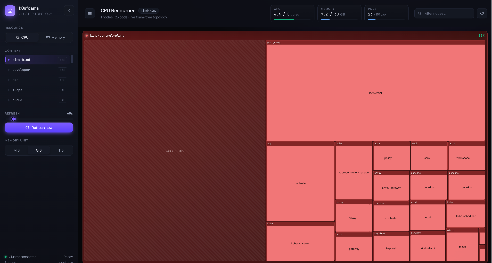
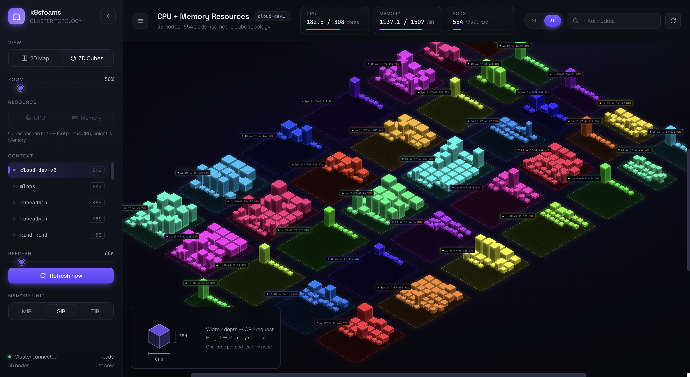

# k8s-pod-foamtree

<p align="center">
  
</p>

**k8sfoams** is a local, read-only dashboard that answers one question: *where is my cluster's requested CPU and memory actually going, and how much room is left on each node?*

It visualizes **resource requests** — what the scheduler reserves — not live usage. That makes it a tool for spotting over-requesting pods and idle headroom, not a performance monitor. It runs on your laptop, reads *~/.kube/config* (or `$KUBECONFIG`) with the standard Kubernetes client, and needs no in-cluster deployment and no metrics-server.

## How it works

1. Lists nodes (`status.capacity`) and all non-terminated pods. Pods in `Succeeded`/`Failed` are excluded — they still report requests via the API but no longer reserve anything.
2. Normalizes CPU to millicores and memory with `bitmath`. A pod's **effective request** is `max(sum(regular containers), max(init containers))` — init containers run sequentially, so they are maxed, not summed. This is what the scheduler actually reserves.
3. Nests the result node → pod → container and adds a synthetic `empty` child per node for free capacity, then serves it as JSON.
4. A React single-page app (no build step — React and Babel come from a CDN) fetches CPU and memory in parallel, merges them, and renders. The view auto-refreshes every 60 seconds by default.

## 2D map



A squarified treemap. Each node is a square box, each pod is a foam inside it. A pod with more than one container is split into sub-foams. The empty foam is unused (free) capacity on that node. Pick **CPU** or **Memory** with the Resource control.

## 3D cubes



An isometric view: one plate per node, one cube per pod. A cube encodes both resources at once:

- **width × depth** (footprint) → CPU request
- **height** → memory request
- **color** → node

Both dimensions are square-root scaled, so a 10× larger pod is not 10× wider. Because a cube already shows both resources, the CPU/Memory picker is disabled in 3D and a **Zoom** slider takes its place.

Switch views with the sidebar *View* control or the `2D`/`3D` pill in the header. It is client-side state — no flag, no restart. The scene is pure CSS 3D, not WebGL, so it needs no GPU support.

## Controls

- **Memory unit**: MiB, GiB (default), or TiB.
- **Context**: the sidebar lists every context from your kubeconfig, active one first, tagged by provider. **Switching only changes the context inside the k8sfoams web server — your ~/.kube/config file is never modified.**
- **Refresh**: slider from 5 to 600 seconds, plus a *Refresh now* button.
- **Filter**: the header query bar highlights matching pods and dims the rest — nothing is removed from the view. See [Filtering](#filtering) for the full grammar.
- **Focus**: click a node to open an overlay listing its pods with per-pod CPU/memory and container breakdown.

## Node health

Free capacity on a node that refuses pods is not really free. A node that is cordoned, under pressure, or carrying a `NoSchedule` taint has its **idle foam hatched with diagonal warning stripes** (the plate surface in 3D), gets a warning badge next to the utilization percentage, and lists a **Node health** key in the sidebar counting how many nodes are affected by each reason. A healthy cluster looks exactly as it did before — nothing is added.

| Marker | Reason | Meaning |
| --- | --- | --- |
| red | `cordoned` | `spec.unschedulable` is true — someone ran `kubectl cordon` |
| red | `not ready` | the `Ready` condition is `False` or `Unknown` |
| amber | `mem pressure`, `disk pressure`, `pid pressure` | the matching kubelet condition is `True` |
| blue | `tainted` | at least one taint has effect `NoSchedule` or `NoExecute` |

Two rules are worth knowing:

- **`PreferNoSchedule` never marks a node.** It is a soft hint the scheduler is free to ignore, so it is listed in the focus overlay but does not stripe.
- **The cordon taint is folded into `cordoned`.** Kubernetes adds `node.kubernetes.io/unschedulable:NoSchedule` itself when you cordon; reporting it as a taint too would mark the same node twice for one fact, so it is dropped from the taint list.

Click a node to open the focus overlay: a **Scheduling** section spells out every reason and lists each taint as `key=value` with its effect. Worst reason wins the header pill — a cordoned node under memory pressure reads as `SCHEDULING-DISABLED`, because that is what actually keeps pods off it.

## Filtering

The query bar in the header is a **highlighter, not a filter of last resort**: matching pods glow, everything else dims. No pod, node or box ever leaves the layout, so the shape of the cluster stays comparable while you narrow down. Once the query is non-empty and valid, a live counter inside the input reads `N / M pods` (and turns red at `0`).

Type whitespace-separated tokens. **All tokens are ANDed** — a pod must satisfy every one of them:

```
ns:kube-system qos:Burstable app=frontend
```

An empty query matches everything. A query that contains a malformed token is **inert**: nothing dims, and the offending tokens are listed under the bar with the reason. Half-typing `ns:` can never blank the view.

### Token reference

| Token | Matches | Notes |
| --- | --- | --- |
| `ns:<name>` | pod namespace, exact | case-insensitive (`ns:Kube-System` works) |
| `node:<glob>` | node the pod is scheduled on | `*` is the only wildcard; anchored (whole name must match); case-insensitive |
| `qos:<class>` | `Guaranteed`, `Burstable`, `BestEffort` | case-insensitive; anything else is an error |
| `has:init-containers` | pods declaring at least one init container | currently the only `has:` field |
| `key=value` | pod label equals value | key and value are **case-sensitive** (Kubernetes labels are) |
| `key!=value` | pod label differs from value | a **missing** label counts as unequal, so it matches too |
| `text` | pod name contains `text` | case-insensitive substring |
| `"quoted text"` | pod name contains `quoted text` | quotes force literal text — the grammar is skipped |

### Examples

Every pod named like `nginx`, anywhere:

```
nginx
```

Pods in `kube-system` that run init containers:

```
ns:kube-system has:init-containers
```

Everything the scheduler can evict first, on the worker pool:

```
qos:BestEffort node:worker-*
```

Frontend pods that are **not** in production, named like `api`:

```
app=frontend env!=prod api
```

One specific node — globs are anchored, so dots are literal, not wildcards:

```
node:ip-10-0-1-5.ec2.internal
```

All nodes in an AZ suffix, plus a namespace:

```
node:*-eu-west-1a ns:payments
```

Guaranteed pods carrying a label value with a space:

```
qos:Guaranteed app="my app"
```

Match a pod name that *looks* like a filter token — leading quotes make the whole token literal text:

```
"web:1"
```

Without the quotes, `web:1` is read as an unknown filter prefix and reported as an error.

### Sharp edges

- **`!=` wins over `=`.** `env!=prod` is one inequality, never `env!` equals `prod`.
- **A filter prefix must be a bare word before `:`.** `app=ns:x` is a label selector for key `app`, value `ns:x` — not a namespace filter.
- **Only `node:` can dim a node.** Node plates and boxes stay in the layout either way; pod-level terms dim pods, never their node.
- **A missing label matches `!=`.** `env!=prod` highlights pods with `env: staging` *and* pods with no `env` label at all — the Kubernetes selector semantics.
- **Every problem is reported at once.** The parser never stops on the first bad token, so a three-error query lists three errors.

### Errors you can hit

| Query | Message |
| --- | --- |
| `ns:` | `ns: needs a value` |
| `qos:Cheap` | `unknown QoS class — use Guaranteed, Burstable or BestEffort` |
| `has:sidecars` | `unknown has: field — use init-containers` |
| `zone:eu` | `unknown filter — use ns:, node:, qos:, has:` |
| `=frontend` | `label selector needs a key` |
| `app=` | `label selector needs a value` |
| `""` | `empty quoted value` |
| `app="my app` | `unterminated quoted value` |

Focusing the input opens a popover with the same token list; it is replaced by the error list while a token is malformed. The `×` on the right clears the query.

## HTTP API

| Route | Returns |
| --- | --- |
| `GET /` | the dashboard |
| `GET /healthcheck` | `{"status": "ok"}` |
| `GET /resources/cpu`, `GET /resources/memory` | treemap JSON; optional `?context=<name>`. CPU in millicores, memory in decimal kB. Each node group also carries `unschedulable`, `taints`, `conditions` and a render-ready `warnings` list — see [Node health](#node-health) |
| `GET /contexts` | `[{"context": "...", "active": true}]` |

## Installation

### Prerequisites
Install [uv](https://docs.astral.sh/uv/) package manager:
```bash
curl -LsSf https://astral.sh/uv/install.sh | sh
```

### Install from source
```bash
# Install dependencies and the package in development mode
make restore_dev

# Or install without dev dependencies
make restore
```

### Install via PyPi
```bash
pip install k8sfoams
# or with uv
uv pip install k8sfoams
```

## Run k8s-pod-foamtree
After installation, run the application:
```bash
# Using make
make run

# Or directly
k8sfoams

# Or with uv run
uv run k8sfoams
```

## Command lines arguments
- host: host IP address on which server listen, default is **127.0.0.1**
- port: port number on which server listen, default is **8080**
- d: turn on **debug** mode when server starts

Example:
```bash
k8sfoams --host 0.0.0.0 --port 8080 -d
```

## Development

### Running tests
```bash
# Run all tests (type checking, linting, security, unit tests)
make tests

# Run individual test suites
make unit_tests
make static_code_analysis
make check_types
make bandit
```

### CI/CD targets
For CI/CD environments (GitHub Actions, etc.), use these targets that work with system Python:
```bash
make restore_ci   # Install dependencies with --system flag
make tests_ci     # Run all tests without uv run prefix
```

### Building the package
```bash
make build
```

### Clean build artifacts
```bash
make clean
```